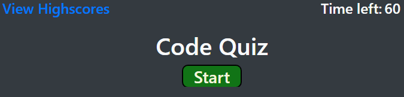
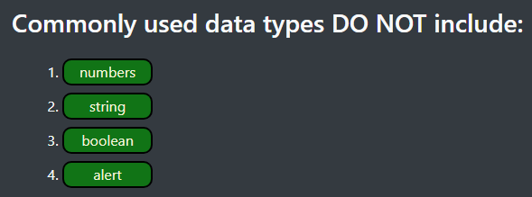
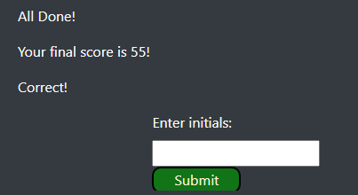

<h1><a href="https://jamehzlee.github.io/Code-Quiz/">Code Quiz</a></h1>

# Code Quiz start screen 
User can click the start button to start the quiz or view highscores

# Quiz Question
Time penalty for wrong answers and increase for correct answers

# Quiz complete
Allows user to input initials to store in highscores

